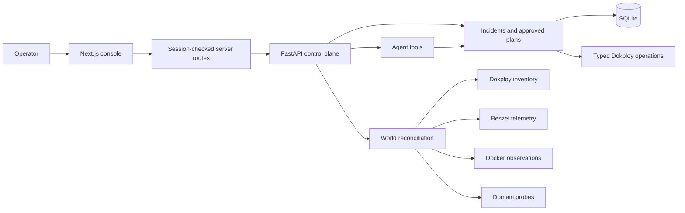

<div align="center">

# NightWatch

### See more. Keep it running.

**An infrastructure world with an operational memory.**

Explore services in 3D. Trace the evidence behind their health. Turn intent into reviewed infrastructure changes.

[Architecture](docs/architecture.md) · [Engineering story](docs/engineering.md) · [Setup & deployment](docs/operations.md) · [API & workflows](docs/reference.md)

</div>

---

## The idea

A deployment dashboard knows what you configured. A container monitor knows what is running. A domain check knows whether the outside world can reach it. During an incident, you need all three to agree—or explain why they do not.

NightWatch brings those perspectives into one private operations console. It combines **Dokploy inventory, Beszel telemetry, Docker identity, and HTTP observations** into an explorable infrastructure map, then connects that map to persistent incidents and an agent that can prepare operational changes for approval.

Built by **Midhun P M**, the project spans a Next.js interface, a FastAPI control plane, a spatial graph renderer, asynchronous observation services, and a persisted workflow layer. The difficult part is making these systems tell a consistent story when their names, timestamps, availability, and definitions of success differ.

## What you can do

| Surface | What it gives the operator |
| --- | --- |
| **Infrastructure world** | Textured project islands, service inspection, domain routes, network relationships, and a 2D alternative. |
| **Live observations** | Beszel-backed telemetry with source freshness, Docker-assisted container matching, and external domain checks. |
| **Incident history** | Recorded triggers, exact event times, observations, evidence, hypotheses, repair records, and verification results. |
| **Conversational operations** | A Luna-powered chat interface with typed tools, persistent conversations, streamed activity, and reviewable action plans. |
| **Deployment workflows** | Repository and branch selection, Dockerfile configuration, requested ports, domain attachment, approval, execution, and retry handling. |
| **Dokploy actions** | Supported start, stop, deploy, redeploy, update, and selected resource-management operations behind approval gates. |
| **Reports** | Current operational summaries and CSV export. |

**Scope:** NightWatch is a private, single-operator application. It is not a complete replacement for Dokploy or a claim of unrestricted autonomous administration. Available operations are explicitly registered by resource type; database and volume deletion are not exposed as agent operations.

## Inside the system



The observation side assembles evidence. The workflow side persists intent and decisions. The agent uses application tools to move between them; it does not replace the application’s policy checks.

## The engineering behind the interface

### One service, several identities

A Dokploy application ID is not a container name. Compose services introduce another naming layer, while runtime replicas and telemetry records may have different identifiers again. NightWatch reconciles these identities before associating observations with a service. Missing or stale matches remain visible as unavailable evidence instead of becoming invented metrics.

### A world that remains readable as it changes

The 3D map uses deterministic positioning and connection-aware relaxation. Project, domain, and network nodes share an explicit graph; edges are drawn from resolved endpoints. The flat view provides a practical alternative when spatial navigation is unnecessary. Camera behavior and layout are operational concerns: an interface that loses your position on refresh interrupts diagnosis.

### From a sentence to a controlled change

“Deploy this repository” implies a chain of stateful work: identify the source, select the environment, configure the build, attach routing, launch the deployment, and inspect what happened. NightWatch persists those workflows rather than treating a model response or a newly created blank service as proof of completion.

Existing-resource action plans bind approval to a version and a snapshot of relevant target fields. If the target changes before execution, the action fails instead of silently applying an old decision to a new state.

### Operational memory with timestamps

Incidents preserve observations and timeline events separately from the summary record. The interface exposes their recorded dates, payloads, affected resources, and subsequent actions. Exact timestamps make the sequence inspectable; relative ages are supplementary navigation aids.

Read the [engineering story](docs/engineering.md) for the implementation tradeoffs and the failures that shaped them.

## Technology

| Layer | Implementation |
| --- | --- |
| Interface | Next.js 16, React 19, TypeScript, Lucide |
| Spatial rendering | Three.js, React Three Fiber, Drei |
| Control plane | Python 3.12, FastAPI, Pydantic, HTTPX |
| Persistence | SQLite, SQLAlchemy async, Alembic |
| Agent integration | Codex app-server for operator chat; OpenAI SDK for bounded incident investigation |
| Infrastructure sources | Dokploy, Beszel, Docker, Traefik-derived routes, HTTP probes |
| Delivery | Independent Docker services, Dokploy, GitHub Actions |

Operator chat is pinned in code to `gpt-5.6-luna`. Manual incident investigation uses `gpt-5.4-mini`, with a maximum of three tool calls and 1,200 output tokens per configured model response. Monitoring does not automatically launch investigations. These are application settings, not a promise about provider availability or a fixed cost per conversation.

## Run it

Requirements: Python **3.12**, `uv`, Node.js **24**, npm, and the integration credentials for the capabilities you want enabled.

```sh
cp .env.example .env
# Replace the placeholder access credentials before starting.
make install
make migrate
make dev
```

In a second terminal:

```sh
cd frontend
cp ../.env.example .env.local
# Use the same frontend/operator tokens as the backend.
# Set a distinct session secret of at least 32 characters.
npm ci
npm run dev
```

Open `http://localhost:3000` and sign in with the configured operator passphrase. The Python app reads the root `.env`; Next.js reads environment configuration from `frontend/`. Optional sources must be configured before their live data is available.

For service boundaries, persistence, health checks, and deployment troubleshooting, use the [operations guide](docs/operations.md). The root Compose file is a **backend-only definition**, not a one-command deployment of the entire stack.

## Quality and boundaries

GitHub Actions defines backend linting, strict typing, tests, migration validation, Compose validation, and a backend image build. The frontend workflow runs linting, type checking, tests, and a production build. Runtime behavior still needs inspection: a successful build cannot prove that a populated browser view renders or that an upstream service is reachable.

There are deliberate boundaries. SQLite persistence is not a distributed control-plane database. Shared-network membership is not proof of an application dependency. An accepted Dokploy action and target readback are not proof that the application serves healthy traffic. The [reference](docs/reference.md) explains those distinctions.

## Explore the repository

```text
backend/nightwatch/
  adapters/       External-system clients and probes
  agents/         Chat app-server and bounded investigator
  api/            FastAPI route groups
  services/       Observation, reconciliation, and workflow orchestration
  models/         Persistence and response contracts
  policy/         Deterministic action policy
  remediation/    Narrow repair execution and verification
  security/       Access controls and redaction
  events/         Realtime event delivery
backend/migrations/   Database evolution
frontend/app/         Console routes and authenticated server gateway
frontend/components/  World, incidents, chat, deployments, and telemetry
frontend/lib/         Session, HTTP, and graph-layout utilities
tests/                Backend behavior and integration-boundary tests
frontend/tests/       Frontend utility and graph tests
docs/                 Architecture, engineering, operations, and API guide
```

Texture provenance is recorded in [asset licenses](frontend/public/textures/ASSET_LICENSES.md). This documentation does not grant a software license; consult any license supplied with your copy before redistribution.
