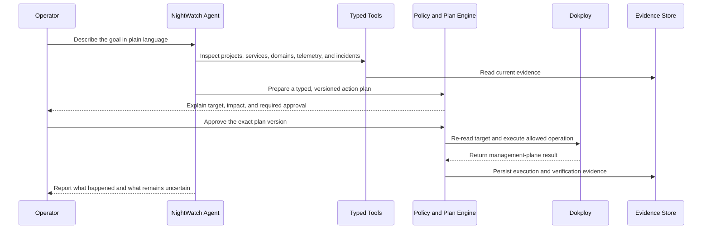
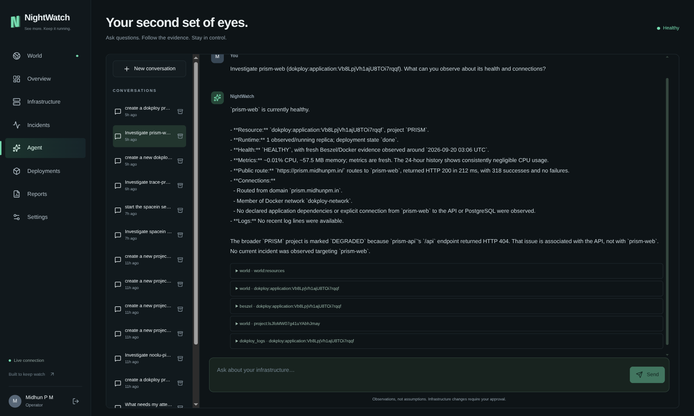
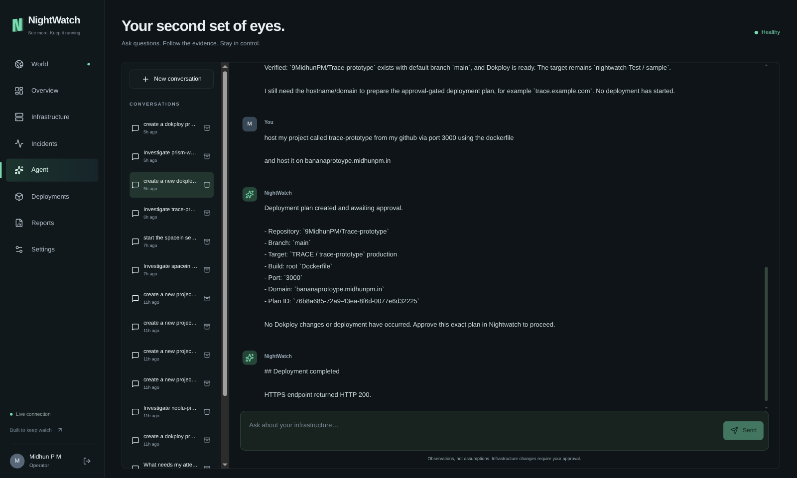
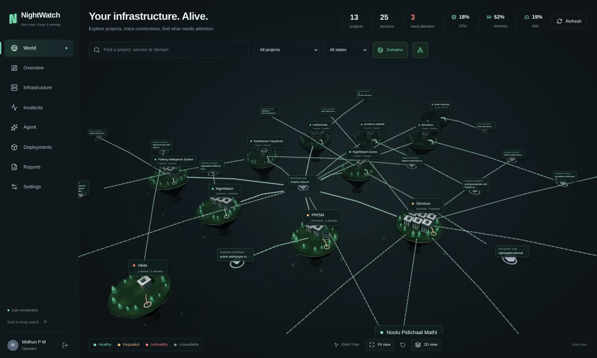
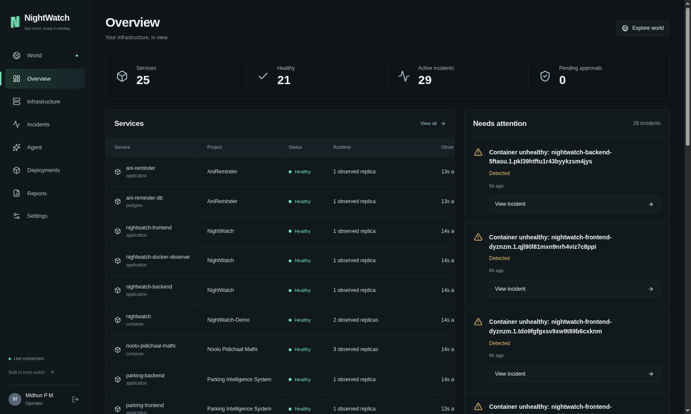
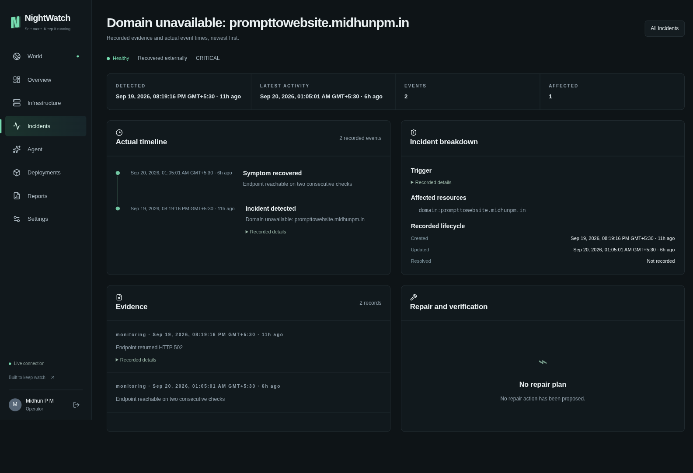
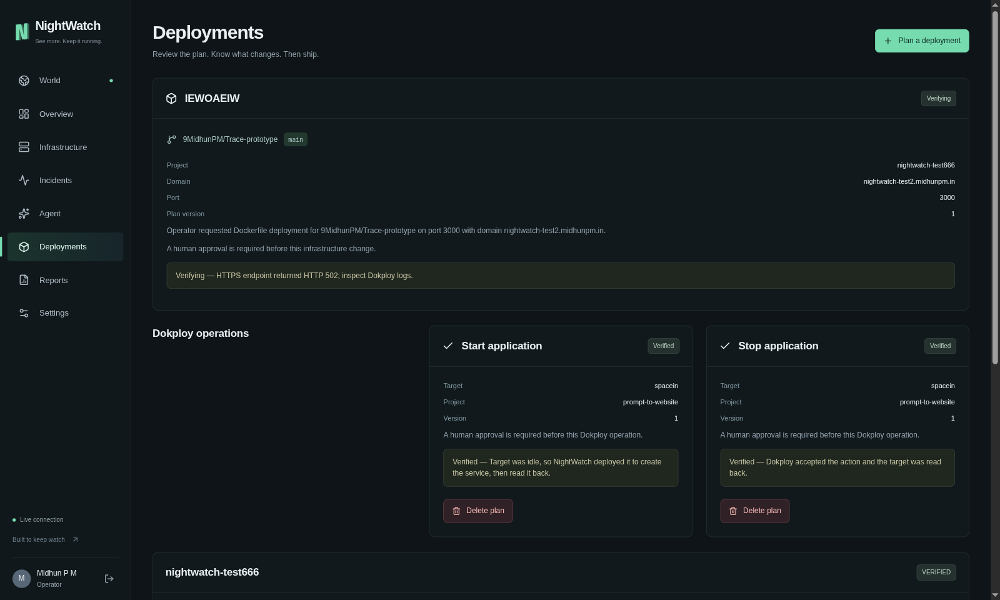

# NightWatch

## Overview

NightWatch is an **agentic infrastructure operations console** that turns natural-language intent into observable, reviewable, and approval-bound infrastructure work.

Instead of making an operator jump between a deployment panel, container monitor, domain checker, logs, and an AI chat window, NightWatch builds one live model of the environment. Its agent can inspect that model through typed tools, explain what it finds, prepare deployment or Dokploy operation plans, wait for human approval, execute the accepted change, and preserve the outcome as operational history.

The experience is presented through an interactive 3D infrastructure world, a practical 2D view, live telemetry, evidence-rich incidents, persistent agent conversations, deployment workflows, and operational reports.

**Live application:** [https://nightwatch.midhunpm.in](https://nightwatch.midhunpm.in)

**Narrated demo:** [Watch NightWatch investigate and operate live infrastructure](https://drive.google.com/file/d/1TDCbsb495BiY4YK6dNxIdD-WkLR4p85g/view?usp=sharing)

[Architecture](docs/architecture.md) · [Engineering story](docs/engineering.md) · [Setup and deployment](docs/operations.md) · [API and workflows](docs/reference.md)

## Problem Statement

Infrastructure operations are fragmented across tools that each know only part of the truth:

* Dokploy knows what was configured, but a configured service is not necessarily running or reachable.
* Docker knows about containers, but container names and replicas do not always map cleanly back to projects.
* Beszel knows about telemetry, but its runtime records need to be reconciled with deployment identities.
* A domain probe knows whether a public route responds, but not why it failed or which change created it.
* A conventional chatbot can suggest commands, but a suggestion is not a safely executed or verified operation.

That fragmentation becomes expensive during incidents and deployments. Operators spend time reconstructing context, comparing timestamps, translating the same intent across several control panels, and deciding whether a reported success means “API accepted,” “container started,” or “application is healthy.”

The harder problem is agentic automation. Giving a model unrestricted infrastructure access is unsafe, while limiting it to prose makes it little more than a search box. A useful infrastructure agent needs enough power to investigate and act, while preserving identity, intent, approval, target state, execution results, and failure evidence.

## Solution

NightWatch implements an **evidence-first agentic control plane** around Dokploy and the surrounding observability stack.

The operator can ask the agent to investigate a service, inspect connections, prepare a deployment, start or stop an application, redeploy a workload, or perform another registered Dokploy operation. The model does not receive a generic shell. It receives typed application tools backed by deterministic services and policy checks.

For infrastructure mutations, NightWatch converts intent into a persisted plan instead of immediately firing an API request. The plan records the target, action, parameters, version, policy reason, relevant observed state, and conversation that produced it. The operator reviews and approves that exact version. Before execution, NightWatch reads the target again and rejects stale plans when the resource no longer matches the state that was approved.

This makes the workflow closer to an operations team than a chatbot:



The agent operates on a reconciled infrastructure world assembled from Dokploy inventory, Docker identity, Beszel telemetry, routes, and HTTP observations. Missing data remains unavailable instead of being replaced with invented metrics. Incidents store observations, evidence, hypotheses, timeline events, repair plans, approvals, actions, and verification checks as separate records, so the system can explain how it reached a conclusion.

NightWatch also handles awkward real-world lifecycle behavior. For example, Dokploy's application `start` path can stall when an application is idle and has no running service to resume. NightWatch checks the target state and uses deployment as the deterministic start operation for idle or errored applications, then reads the resource back and records the substitution. The agent does not pretend that management-plane acceptance proves public application health; route and incident evidence remain separate.

## Features

* **Agentic operations chat** powered by `gpt-5.6-luna`, with streamed activity, persistent conversations, citations, typed tools, and reviewable pending actions.
* **Natural language to deployment workflow** for repository, branch, Dockerfile, port, domain, project, environment, approval, execution, verification, and retry state.
* **Everyday Dokploy operations** including registered start, stop, deploy, redeploy, reload, update, cancellation, domain, project, environment, and selected deletion workflows.
* **Human approval gates** for infrastructure mutations, with exact plan versions and explicit policy reasons.
* **Stale-state protection** that binds approval to a snapshot of the target and revalidates it before execution.
* **Fail-closed action registry** that exposes operations by resource type instead of giving the model an unrestricted shell.
* **Protected data boundaries** that do not expose database or volume deletion as agent operations and reject secrets in action parameters.
* **Bounded incident investigator** using `gpt-5.4-mini`, structured outcomes, redacted context, a three-tool-call ceiling, output limits, and timeouts.
* **Cost-aware separation** between continuous monitoring and model investigation; monitoring does not automatically launch an AI investigation on every observation.
* **Live infrastructure world** with textured 3D project islands, service health, domain gateways, shared networks, and graph-derived connections.
* **Deterministic, connection-aware layout** that keeps the world stable across refreshes and arranges projects using explicit relationships.
* **2D infrastructure view** for dense operational reading without spatial navigation.
* **Multi-source reconciliation** across Dokploy, Docker, Beszel, routes, and domain probes.
* **Freshness-aware telemetry** that distinguishes fresh measurements, stale samples, unavailable evidence, degraded services, and confirmed failures.
* **Evidence-rich incident timelines** with exact dates, triggers, affected resources, raw recorded details, hypotheses, actions, and verification checks.
* **Realtime updates and polling fallback** so the operator can keep watching the environment while upstream systems change.
* **Operational reports and CSV export** for the current host, container, resource, and incident view.
* **Private operator access** with signed HTTP-only sessions, exact-origin checks, server-held integration credentials, and allowlisted frontend proxy routes.

## Tech Stack

* **Frontend:** Next.js 16, React 19, TypeScript, Three.js, React Three Fiber, Drei, Lucide
* **Backend:** Python 3.12, FastAPI, Pydantic, SQLAlchemy Async, HTTPX, Uvicorn
* **Database:** SQLite with `aiosqlite` and Alembic migrations
* **APIs / Services:** Dokploy API, Beszel API, Docker API, Traefik-derived routes, HTTP domain probes, OpenAI API, Codex app-server
* **Hosting / Deployment:** Separate frontend, backend, and Docker observer services on Dokploy; Dockerfiles; persistent backend volume; private service networks; GitHub Actions
* **Other Tools:** `uv`, npm, Ruff, strict mypy, pytest, ESLint, TypeScript, Playwright MCP

## Codex / OpenAI Usage

AI is both part of the product and part of how NightWatch was engineered during the hackathon.

### Inside NightWatch

The main operator agent runs through the Codex app-server and is pinned in application code to **`gpt-5.6-luna`**. It is given a catalog of typed NightWatch tools rather than direct shell access. Those tools let it inspect infrastructure state, incidents, telemetry, conversations, deployment readiness, repositories, branches, and supported Dokploy targets. When a request requires mutation, the agent prepares the persisted plan that appears in the NightWatch UI for approval.

A separate manual incident investigator uses **`gpt-5.4-mini`** through the OpenAI SDK. It receives redacted incident context, gathers fresh evidence through read-only investigation tools, and must return a structured outcome containing a summary, observations, and evidence-linked hypotheses. Its tool calls, output, and execution time are bounded. Continuous monitoring is deliberately disconnected from automatic model invocation so ordinary health checks do not silently create an uncontrolled API bill.

The application layer remains authoritative. Models can select tools and synthesize evidence, but policy evaluation, action registration, secret rejection, target identity checks, plan versioning, approval, stale-state detection, persistence, and execution live in deterministic code.

### During the build

Codex was used as an engineering collaborator across the full build:

* turning the initial idea into a frontend, control-plane, persistence, and service-boundary architecture;
* generating and refactoring FastAPI routes, Pydantic contracts, SQLAlchemy models, Alembic migrations, Next.js components, and Three.js scene logic;
* tracing integration mismatches between Dokploy applications, Compose services, Docker replicas, Beszel records, domains, and routes;
* debugging real deployment failures such as invalid Dokploy request contracts, empty upstream responses, lifecycle-specific start behavior, stale Docker build layers, and backend serialization errors;
* finding a browser-only `Intl.DateTimeFormat` crash that passed static checks but failed when a populated incident page rendered;
* improving the 3D world from a circular scene into a deterministic relationship-aware graph while preserving camera state;
* enforcing model selection and investigation budgets in configuration and runtime code;
* writing tests, running lint/type/build/migration checks, reading production logs, and validating deployed behavior;
* producing the architecture, engineering, operations, API, and hackathon documentation;
* using Playwright MCP against the authenticated production application to capture the screenshots below.

AI accelerated implementation and diagnosis, but the work still required inspecting live evidence, correcting assumptions, testing integration contracts, and separating a successful command from a verified operational outcome.

## Demo

### Live Demo

[Launch NightWatch](https://nightwatch.midhunpm.in)

NightWatch is a private single-operator console, so access requires the configured operator passphrase.

### Demo / Pitch Video

[](https://drive.google.com/file/d/1TDCbsb495BiY4YK6dNxIdD-WkLR4p85g/view?usp=sharing)

The narrated walkthrough shows the live infrastructure world and the agentic operations loop: inspect real state, correlate evidence, prepare a typed change, require approval, execute through Dokploy, and verify the outcome.

## Screenshots

### One question, five evidence sources



The operator asks one plain-language question. NightWatch identifies the exact Dokploy resource, checks its running replica, reads fresh Beszel metrics, probes the public route, inspects network membership and recent logs, then cites every source it used. Here it correctly separates a healthy `prism-web` service from a project-level degradation caused by `prism-api`, instead of collapsing both into a vague status.

### From intent to a verified deployment



A natural-language request becomes a concrete, versioned deployment plan with the repository, branch, production target, Dockerfile, port, domain, and plan ID spelled out before any mutation occurs. After approval, NightWatch executes the registered Dokploy workflow and reports the post-execution HTTPS check: HTTP 200.

### Agentic infrastructure world



The live world reconciles projects, services, host telemetry, health, domain gateways, and network relationships. Connections retain provenance; shared-network membership is shown as context rather than claimed as a proven application dependency.

### Operations overview



The overview combines observed replicas, source timestamps, health states, and active incidents from the same world model used by the 3D scene.

### Evidence-backed incident timeline



The incident view records the original HTTP 502, later successful checks, affected resource, and exact event times. Detection, evidence collection, latest activity, and recovery stay separate and inspectable.

### Approval-bound automation



Deployment and Dokploy operation cards preserve source, target, port, domain, plan version, policy reason, status, and execution result. A management operation can be verified while public endpoint evidence still reports a problem.

## How to Run Locally

Requirements: Python **3.12**, [`uv`](https://docs.astral.sh/uv/), Node.js **24**, npm, and credentials for the integrations you want to enable.

```bash
git clone https://github.com/9MidhunPM/NightWatch.git
cd NightWatch
cp .env.example .env

# Replace every placeholder access value before starting.
make install
make migrate
make dev
```

In a second terminal:

```bash
cd NightWatch/frontend
cp ../.env.example .env.local

# Keep the frontend/operator tokens consistent with the backend.
# Use a distinct session secret with at least 32 characters.
npm ci
npm run dev
```

Open [http://localhost:3000](http://localhost:3000) and sign in with `NW_DASHBOARD_PASSPHRASE`.

The backend reads the repository-root `.env`; Next.js reads `frontend/.env.local`. Live Dokploy, Beszel, Docker, agent, and deployment features become available only when their integrations are configured. See the [operations guide](docs/operations.md) for the environment map and production service layout.

Run the validation suites with:

```bash
make check
make test

cd frontend
npm run lint
npm run typecheck
npm test
npm run build
```

## Additional Notes

NightWatch is built as a private, single-operator control plane. It is not presented as a full Dokploy replacement, a distributed monitoring database, or an unrestricted autonomous administrator.

Important current boundaries:

* SQLite is appropriate for this private control plane but is not a horizontally distributed data store.
* Network membership shows possible connectivity, not proven request direction or business dependency.
* General Dokploy action verification currently means that the management API accepted the action and the target was read back; end-to-end application health remains separate evidence.
* Login throttling is process-local, and the current private access model is not organization-wide RBAC.
* Incident history is returned as a detailed list; pagination and dedicated detail loading are future scaling work.
* Agent and investigation calls can incur provider costs despite the current bounds.
* The public demo video shows a representative operator workflow; the live console remains passphrase protected because it controls real infrastructure.

Future plans include richer post-action health verification, dependency inference from observed traffic, paginated incident history, multi-operator roles, distributed session controls, deeper deployment rollback workflows, and evaluation datasets for measuring investigation quality and tool efficiency.

For the harder implementation details and the failures overcome during development, read the [engineering story](docs/engineering.md). Texture provenance is documented in [asset licenses](frontend/public/textures/ASSET_LICENSES.md).
