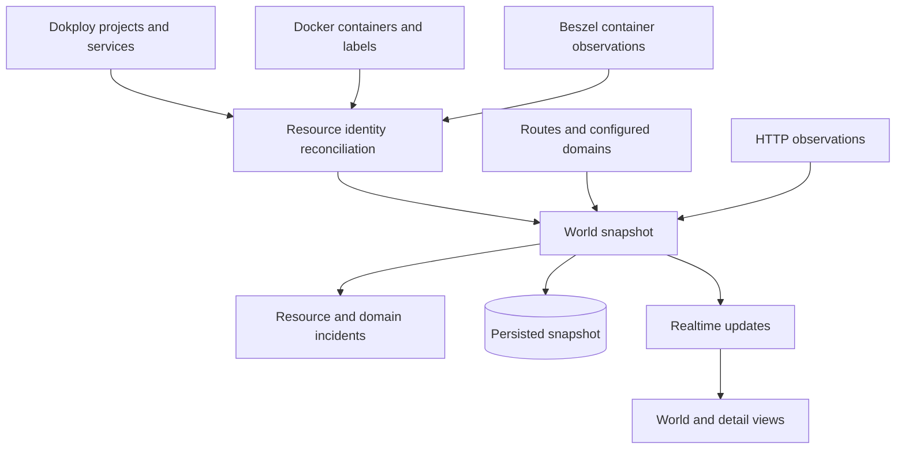

# Architecture

[← README](../README.md) · [Operations](operations.md) · [Reference](reference.md)

NightWatch is organized around three responsibilities: **observe infrastructure, preserve evidence, and execute reviewed intent**. The renderer and chat interface are consumers of that control plane.

## Runtime boundaries

The browser talks to Next.js. Next.js validates the operator session and proxies only allowlisted backend routes. FastAPI owns integration credentials, observation services, persistent records, and operation execution. Docker observation belongs behind a private observer or restricted socket proxy; the backend should not receive an unrestricted host socket.

| Boundary | Responsibility | Main implementation |
| --- | --- | --- |
| Browser → frontend | Navigation, spatial interaction, forms, streamed activity | `frontend/components/` |
| Frontend → backend | Session checks, endpoint allowlists, server-held access headers | `frontend/app/api/`, `frontend/lib/server.ts` |
| Backend → integrations | HTTP/Docker access, response normalization, errors | `backend/nightwatch/adapters/` |
| Evidence → workflows | Incident lifecycle, persisted plans, approval, retry | `backend/nightwatch/services/` |
| Workflow → mutation | Resource-specific allowlists and target checks | `dokploy_action_service.py`, `deployment_service.py` |

## Reconciliation pipeline

`WorldService` runs observation cycles on a ten-second loop and refreshes inventory on a separate sixty-second cadence. Those are implementation cadences, not a guaranteed end-to-end refresh SLA. Integration latency and failures affect when a new snapshot is available.

Runtime reconciliation uses Dokploy identifiers and Docker matches to associate Beszel records with resources. The current Beszel adapter marks records stale when their timestamp is absent or older than seventy seconds. Freshness is part of the evidence contract: a known project can legitimately have unavailable runtime telemetry.

Snapshots are serialized through Pydantic’s JSON mode before persistence. On restoration, the service identifies the data as restored observations while refreshing live sources. A failed cycle retains the last known view and marks it stale rather than presenting it as newly measured.

## Graph semantics

The frontend graph distinguishes `DEPENDS_ON`, `ROUTES_TO`, and `MEMBER_OF`. Resource endpoints can be projected to their owning project for island-level rendering; domain and network nodes remain explicit when enabled. Edges without usable endpoints are omitted.

Positions begin from stable identifier-derived offsets and are relaxed using repulsion plus relationship forces. This gives the scene a scattered planar layout that responds to connectivity. It is a visualization algorithm, not a representation of physical network geography.

A network membership edge means the resources share a network. It does not establish traffic direction, successful requests, or a business dependency. Keep provenance visible when interpreting the graph.

## Evidence and persistence

SQLite stores incidents, observations, evidence, hypotheses, timeline events, repair plans, approvals, actions, verification records, conversations, and deployment/operation plans through SQLAlchemy models and Alembic migrations.

Observations describe collected facts. Hypotheses describe possible explanations with supporting or contradicting evidence references. Approval records identify a decision about a plan version. Verification records describe checks after execution. Keeping these concepts separate avoids collapsing “suggested,” “approved,” “executed,” and “recovered” into one ambiguous status.

The current incident UI reads the incident list response, which includes detailed records. This is convenient for a modest private installation but increases payload size as history grows. Pagination and a dedicated detail-fetch strategy are natural scaling work, not features claimed by this implementation.

## Agent execution

Operator chat uses the Codex app-server integration and application-provided dynamic tools. The configured chat model is pinned to Luna. The separate investigator uses a bounded tool loop, a structured outcome schema, timeout handling, and redacted context.

The monitoring service is wired without an automatic investigator. Evidence collection can run continuously without paying for a model investigation on every observation. An operator-triggered investigation is a separate action.

## Security model and practical limits

The frontend issues HMAC-signed, eight-hour sessions. Cookies are HTTP-only, use strict same-site handling, and are secure in production. Mutating frontend routes check the expected origin. Backend requests carry the frontend token, with operator authorization added for privileged requests.

Production settings require a sufficiently long frontend token and HTTPS CORS/WebSocket origins. Typed operation plans constrain supported resource/action combinations; approvals include version checks and relevant-state comparison. Deletion of supported non-database resources additionally requires a name confirmation.

These controls are application boundaries, not a security certification. Login attempt limiting is process-local, sessions are shared-passphrase based, and the architecture does not implement organization-wide RBAC or distributed session revocation. Deploy it as a private operator console with appropriately restricted integration credentials.
