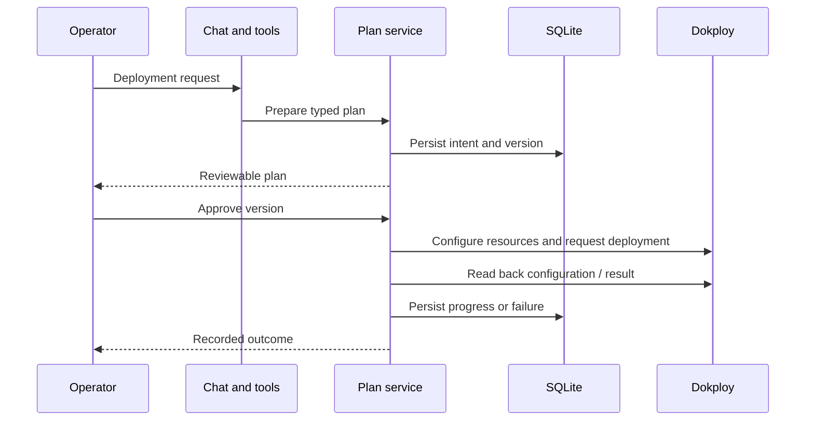

# Workflows and API reference

[← README](../README.md) · [Architecture](architecture.md) · [Operations](operations.md)

This is a guide to the implemented route groups, not a replacement for request/response schemas. Backend routes live under `/api`. See `backend/nightwatch/api/` and `backend/nightwatch/models/` for the authoritative contracts. Browser requests go through the authenticated Next.js gateway at `/api/backend/`; that gateway deliberately exposes a subset of backend operations.

## Main route groups

| Backend route | Purpose |
| --- | --- |
| `GET /api/health` | Application liveness response |
| `GET /api/world` | Reconciled world snapshot |
| `GET /api/host`, `/api/host/metrics`, `/api/host/capabilities` | Host observations and capabilities |
| `GET /api/docker/status`, `/api/docker/containers`, `/api/docker/networks` | Docker observations |
| `GET /api/topology` | Topology snapshot |
| `GET /api/incidents`, `/api/incidents/{id}` | Incident records and detailed evidence |
| `POST /api/incidents/{id}/investigate` | Explicit investigation request |
| `POST /api/incidents/repair-plans/{id}/approval` | Versioned repair-plan decision |
| `POST /api/incidents/repair-actions/{id}/rollback` | Narrow repair rollback workflow |
| `GET /api/agent/status` | Agent availability |
| `POST /api/agent/messages`, `/api/agent/stream` | Chat request and streamed chat |
| `/api/agent/conversations` | Conversation collection and detail operations |
| `GET /api/observability/beszel` | Beszel integration observations |
| `GET /api/telemetry/host`, `/api/telemetry/resource` | Telemetry views |
| `GET /api/reports/current`, `/api/reports/current.csv` | Operational reports |
| `/api/deployments/plans` | Deployment planning, approval, retry, deletion |
| `/api/deployments/project-plans` | Project/service plan review and lifecycle |
| `/api/dokploy/actions` | Existing-resource action planning and approval |

The backend realtime path uses a ticket endpoint and WebSocket events. The Next.js event route provides the browser-facing event stream; frontend data hooks also poll. The browser therefore does not need direct integration credentials.

## Deployment request lifecycle

A request such as “Create a project and host this repository on port 80” must retain the deployment intent. Review the proposed repository, owner, branch, Dockerfile, domain, and application port before approval. An explicitly requested application port takes precedence over inferred repository metadata.

A failed workflow can leave resources created by earlier successful steps. Read its recorded detail before retrying. Deleting a plan record is not the same operation as deleting the infrastructure it references.

## Existing-resource actions

The service currently registers these combinations:

| Target | Registered actions |
| --- | --- |
| Application | Start, stop, deploy, redeploy, cancel deployment, reload, update, delete |
| Compose | Start, stop, deploy, redeploy, cancel deployment, update, delete |
| Postgres, MySQL, MariaDB, Mongo, Redis | Start, stop, reload, update |
| Domain | Toggle, update, delete |
| Project, environment | Update, delete |

Registration does not guarantee every Dokploy version accepts every action or parameter. The adapter and upstream API remain the execution boundary. Database and volume deletion are not exposed by this action service.

Plans persist relevant target state, a request digest, and a version. Approval re-reads the target and compares its snapshot before executing. Exact-name confirmation is required for deletion. A changed target fails validation and needs a new plan.

**Meaning of `VERIFIED`:** for general Dokploy actions, the current implementation records acceptance and target readback (with a distinct delete path). This is management-plane verification, not an end-to-end application health test. Incident repair verification is a separate workflow with explicit check records.

## Reading an incident

| Record | Question it answers |
| --- | --- |
| Trigger | What started this incident? |
| Affected resource IDs | Which resources were associated with it? |
| Observation/evidence | What was collected, from which source, and when? |
| Hypothesis | What explanation is being considered? |
| Timeline event | What happened next in the incident lifecycle? |
| Repair plan/approval | What change was proposed and what decision was recorded? |
| Action/verification | What executed and what did the checks observe? |

Detection time, last summary update, observation timestamps, and resolution time are different facts. The detail view exposes recorded timestamps rather than treating one “hours ago” label as the whole timeline. If a record lacks evidence, the UI should not be interpreted as proving a cause.

## Model and cost behavior

Chat is pinned to `gpt-5.6-luna`. The manual investigator uses `gpt-5.4-mini` with a three-call tool limit, bounded response output, and a timeout. Monitoring is wired independently from automatic model investigation. Chat usage and manual investigations can still incur provider charges; the repository does not establish a benchmarked per-incident cost.

## Extension points

Add an integration at the adapter boundary, normalize its output into explicit models, and preserve freshness/source information through the service layer. For a new mutation, implement a typed request, register the resource/action combination, enforce policy and approval, and define what post-action evidence proves success. Add the frontend proxy allowlist entry only if that route should be browser-accessible.

A new integration is complete when its failure behavior is explainable as well as its success behavior. Do not make an exception disappear into a healthy status or represent an empty response as a completed deployment without checking the operation’s contract.
